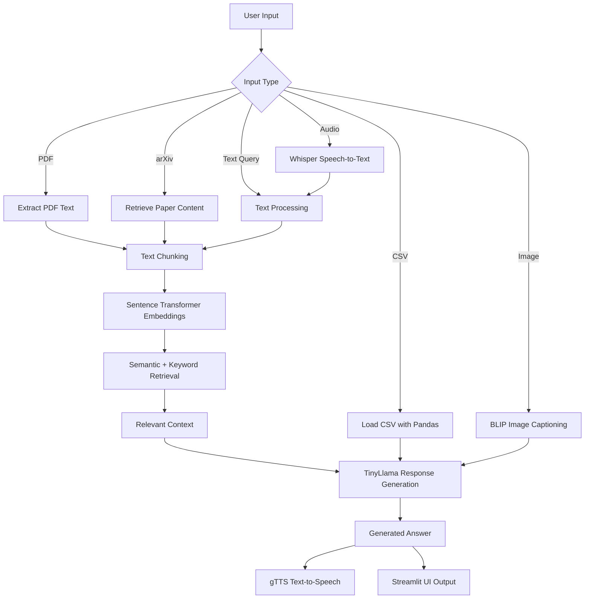

# Multimodal RAG Assistant

A Streamlit-based multimodal AI assistant that combines Retrieval-Augmented Generation (RAG), document question answering, arXiv paper analysis, CSV exploration, image captioning, speech-to-text, text-to-speech, and lightweight conversational memory.

The project demonstrates how multiple AI capabilities can be integrated into one interactive application using open-source models and Python-based AI tools.

---

## Demo

Watch the project demo video here:

[Watch Demo Video on Google Drive](https://drive.google.com/file/d/18gQw4BD4ABPJiE4DlRRBu3qEBrZIWqVb/view?usp=drivesdk)

---

## Overview

Multimodal RAG Assistant is an AI application that allows users to interact with different types of input, including documents, tables, research papers, images, and audio.

The assistant can answer questions from uploaded PDFs, analyze CSV files, retrieve and process arXiv papers, generate image captions, transcribe audio input, and convert generated responses into speech.

The main goal of the project is to build an end-to-end GenAI application that combines text retrieval, multimodal processing, and user-friendly interaction in a single Streamlit interface.

---

## Key Features

- PDF question answering using RAG
- CSV file upload and exploration
- arXiv paper retrieval and analysis
- Semantic document search using sentence-transformer embeddings
- Hybrid retrieval using semantic similarity and keyword matching
- Local LLM-based answer generation
- Image captioning using BLIP
- Speech-to-text using Whisper
- Text-to-speech using gTTS
- Lightweight conversational memory
- Streamlit-based interactive user interface

---

## Tech Stack

| Area | Tools / Models |
|---|---|
| User Interface | Streamlit |
| RAG Pipeline | LangChain-style text chunking, Sentence Transformers |
| Embeddings | `sentence-transformers/multi-qa-MiniLM-L6-cos-v1` |
| Language Model | `TinyLlama/TinyLlama-1.1B-Chat-v1` |
| Image Captioning | `Salesforce/blip-image-captioning-base` |
| Speech-to-Text | Whisper |
| Text-to-Speech | gTTS |
| PDF Processing | PyPDF / PDF text extraction |
| CSV Processing | Pandas |
| Research Paper Retrieval | arXiv API |
| Deployment / Demo | Streamlit, ngrok |

---

## Main Capabilities

### 1. Document Question Answering

The assistant allows users to upload PDF files and ask questions about their content.

The RAG pipeline:

1. Extracts text from the uploaded PDF
2. Splits the text into chunks
3. Creates embeddings for each chunk
4. Retrieves the most relevant chunks for the user query
5. Sends the retrieved context to the language model
6. Generates a grounded answer based on the uploaded document

---

### 2. CSV Exploration

Users can upload CSV files and inspect their structure and content.

The system supports:

- Reading tabular data
- Displaying rows and columns
- Exploring dataset content
- Asking simple questions related to the uploaded data

---

### 3. arXiv Paper Analysis

The assistant can process arXiv papers by accepting an arXiv ID or paper link.

It can:

- Retrieve paper content
- Extract text
- Build a searchable document representation
- Answer questions about the paper using the RAG pipeline

---

### 4. Hybrid Retrieval

The project uses a hybrid retrieval approach that combines:

- Semantic retrieval using sentence-transformer embeddings
- Keyword-based matching for important query terms

This improves the assistant’s ability to retrieve relevant chunks even when the query wording differs from the document wording.

---

### 5. Image Captioning

The system supports image input and generates captions using a BLIP image captioning model.

This allows users to upload an image and receive a natural-language description of its visual content.

---

### 6. Speech-to-Text

The assistant supports audio input using Whisper.

Users can provide spoken input, and the system transcribes it into text before processing it through the assistant pipeline.

---

### 7. Text-to-Speech

Generated responses can be converted into audio using gTTS.

This makes the assistant more interactive and accessible.

---

### 8. Conversational Memory

The assistant includes a lightweight memory mechanism that stores useful facts and preferences during the interaction.

This helps the system retrieve relevant notes and maintain a more contextual conversation.

---

## System Pipeline



---

## Project Structure

```text
multimodal-rag-assistant/
│
├── app.py
│
├── notebooks/
│   └── Multimodal_RAG_Assistant.ipynb
│
├── assets/
│   └── screenshots/
│
├── README.md
├── requirements.txt
└── .gitignore
```

---

## Demo Flow

The demo video shows:

1. Opening the Streamlit assistant
2. Uploading a document or file
3. Asking a question
4. Retrieving relevant context using RAG
5. Generating an answer using the language model
6. Testing image captioning
7. Testing audio transcription
8. Showing text-to-speech output

---

## How to Run

### 1. Install requirements

```bash
pip install -r requirements.txt
```

### 2. Run the Streamlit app

```bash
streamlit run app.py
```

### 3. Open the app in the browser

```text
http://localhost:8501
```

---

## Requirements

The project uses:

```text
streamlit
pandas
numpy
torch
transformers
sentence-transformers
pypdf
arxiv
openai-whisper
gTTS
Pillow
scikit-learn
```

---

## Example Use Cases

### Document QA

User uploads a PDF and asks:

```text
What is the main idea of this document?
```

The assistant retrieves the most relevant document chunks and generates an answer based on the uploaded file.

### arXiv Paper QA

User provides an arXiv paper ID and asks:

```text
What methodology does this paper use?
```

The assistant retrieves the paper content, builds context, and answers using RAG.

### Image Captioning

User uploads an image.

The assistant generates a visual caption describing the image content.

### Audio Question Answering

User uploads or records audio.

The assistant transcribes the audio using Whisper and processes the transcribed question.

---

## Limitations

This project is a prototype and has some limitations:

- The language model is lightweight and may not perform as well as larger LLMs.
- Retrieval quality depends on document structure and chunking quality.
- The system does not include formal retrieval evaluation metrics.
- Audio transcription accuracy depends on audio quality and background noise.
- The memory mechanism is lightweight and not designed for production use.
- ngrok-based sharing is temporary and not a production deployment method.

---

## Future Improvements

Possible future improvements include:

- Add formal retrieval evaluation metrics
- Improve chunk ranking and reranking
- Add support for more document formats
- Add persistent vector database storage
- Replace the lightweight LLM with a stronger model
- Add user authentication
- Deploy the app permanently on Hugging Face Spaces or Streamlit Community Cloud
- Add better memory management and user-specific sessions
- Add source citations for generated answers

---

## What I Learned

Through this project, I practiced:

- Building a RAG-based document question answering system
- Using sentence-transformer embeddings for semantic retrieval
- Combining semantic retrieval with keyword matching
- Integrating open-source language models into a Streamlit app
- Processing PDFs, CSV files, and arXiv papers
- Adding image captioning with BLIP
- Adding speech-to-text with Whisper
- Adding text-to-speech with gTTS
- Building a multimodal AI application prototype

---

## Academic Context

This project was developed as part of an AI / Generative AI application project.

The goal was to explore how different AI modalities can be combined into one assistant that supports text, documents, images, and audio.

---

## Conclusion

Multimodal RAG Assistant demonstrates how Retrieval-Augmented Generation can be combined with vision, audio, document processing, and conversational memory in a single interactive AI application.

The project is a strong prototype for experimenting with multimodal AI workflows and building practical GenAI applications using open-source tools.
